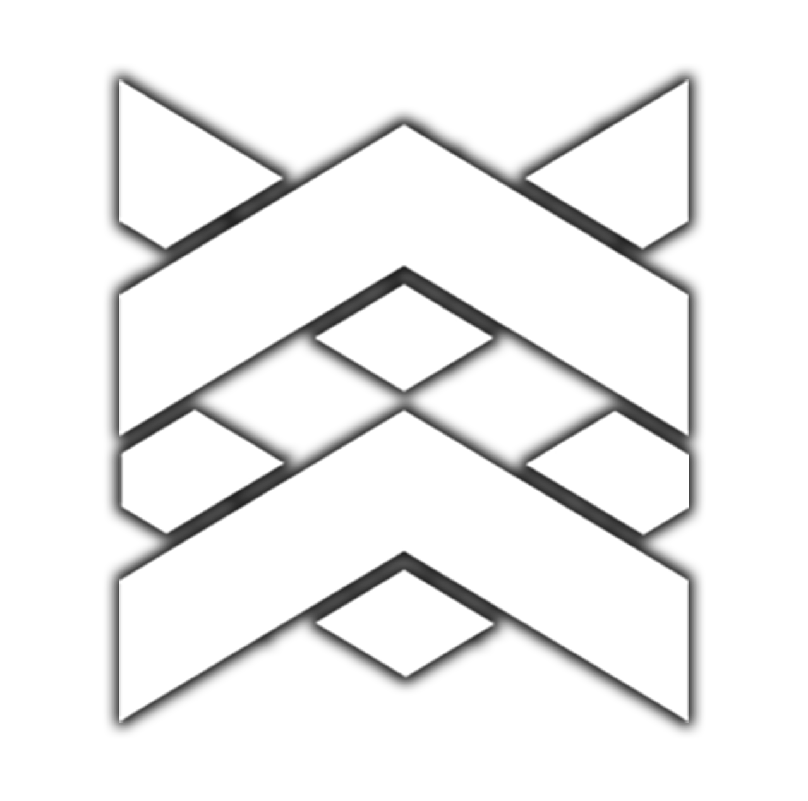

## 👨‍💻 Writeups

- [SECPlayground Challenges Compilation](SECPlayground/README.md)
- [STDiO CTF Competition 2022](STDiO2022/README.md)
- [KPMG Cyber Security Challenge 2021](KPMG2021/README.md)
- [NCSA - Thailand Cyber Top Talent 2021](NCSA2021/README.md)
- [Thailand Cyber Top Students 2021](TCTS2021/README.md)
- more coming soon...

## 💬 Connect with us

[![Website](https://img.shields.io/badge/TNI%20Cybersec-000000?style=for-the-badge&logo=data:image/png;base64,iVBORw0KGgoAAAANSUhEUgAAACAAAAAgCAQAAADZc7J/AAAABGdBTUEAALGPC/xhBQAAACBjSFJNAAB6JgAAgIQAAPoAAACA6AAAdTAAAOpgAAA6mAAAF3CculE8AAAAhGVYSWZNTQAqAAAACAAFARIAAwAAAAEAAQAAARoABQAAAAEAAABKARsABQAAAAEAAABSASgAAwAAAAEAAgAAh2kABAAAAAEAAABaAAAAAAAAAEgAAAABAAAASAAAAAEAA6ABAAMAAAABAAEAAKACAAQAAAABAAAAIKADAAQAAAABAAAAIAAAAABfvA/wAAAACXBIWXMAAAsTAAALEwEAmpwYAAACyGlUWHRYTUw6Y29tLmFkb2JlLnhtcAAAAAAAPHg6eG1wbWV0YSB4bWxuczp4PSJhZG9iZTpuczptZXRhLyIgeDp4bXB0az0iWE1QIENvcmUgNi4wLjAiPgogICA8cmRmOlJERiB4bWxuczpyZGY9Imh0dHA6Ly93d3cudzMub3JnLzE5OTkvMDIvMjItcmRmLXN5bnRheC1ucyMiPgogICAgICA8cmRmOkRlc2NyaXB0aW9uIHJkZjphYm91dD0iIgogICAgICAgICAgICB4bWxuczp0aWZmPSJodHRwOi8vbnMuYWRvYmUuY29tL3RpZmYvMS4wLyIKICAgICAgICAgICAgeG1sbnM6ZXhpZj0iaHR0cDovL25zLmFkb2JlLmNvbS9leGlmLzEuMC8iPgogICAgICAgICA8dGlmZjpZUmVzb2x1dGlvbj43MjwvdGlmZjpZUmVzb2x1dGlvbj4KICAgICAgICAgPHRpZmY6UmVzb2x1dGlvblVuaXQ+MjwvdGlmZjpSZXNvbHV0aW9uVW5pdD4KICAgICAgICAgPHRpZmY6WFJlc29sdXRpb24+NzI8L3RpZmY6WFJlc29sdXRpb24+CiAgICAgICAgIDx0aWZmOk9yaWVudGF0aW9uPjE8L3RpZmY6T3JpZW50YXRpb24+CiAgICAgICAgIDxleGlmOlBpeGVsWERpbWVuc2lvbj42NDwvZXhpZjpQaXhlbFhEaW1lbnNpb24+CiAgICAgICAgIDxleGlmOkNvbG9yU3BhY2U+MTwvZXhpZjpDb2xvclNwYWNlPgogICAgICAgICA8ZXhpZjpQaXhlbFlEaW1lbnNpb24+NjQ8L2V4aWY6UGl4ZWxZRGltZW5zaW9uPgogICAgICA8L3JkZjpEZXNjcmlwdGlvbj4KICAgPC9yZGY6UkRGPgo8L3g6eG1wbWV0YT4Kiv76YwAABbRJREFUSIltVQlQU1cUPTMQrQIVN0RgBARkRwVBqrZ26lKrBcQZsa27FhXptCAkgFOWamldgIq1VnFAO4hLEhgQ0MGlAhIhQEBFFNRasQxbxQDKFkh+7/8/IdD2D2Tecu+579137j2AIYxhAWfBAsFCeMKRxpPwDq0aYhwm0p4JjGgu4OZGmI7Z8BD4kO1c2GIKxoM2zeCG5Qiav8ViAz6GNxxgjskwJWMrMreDNWZiKq1Mp5EHliJw7mbrjfAX+NLcBBTDGkuwySgC0Yj2/MpgA5bBC85wohiLjD8yW0Eu3hTCmeZL4G+700OIGERZ7MWntDoVdOA5NqsQGnO8Srb8JA667HfYjfVYY7Aa6+y22ocgdN4ug88RgDUINNnqFYEEHMopKMyHyGUjAZuDjuZitxYRojMM09MlvoZkHPDcbxQ2PswrGnFI9EhCgmOsrRDhziKzBPwQcq7hEcPUKBC7+EssgiUoEW6z10EUka4aZOh78WfMBRwdn2KdgqM7Mp41dL2+dBWpSPE+hiT8crtsoJ+1Kq9EwsJddCWr0QBDtKNmGNVQXZ3Hb8i4JevnjAn0ebQUp7OKlJ3sTD3MMPJRAJPhahcIoShDNaxhNGrWpPFFZkl7GzvSqDX0saAlNYWV/X06gKoqxPsGYzEP4GITgMjgtP4BdrutQyqTP1SrWWeGfFl3tYbdaW2/XKZ4pOZClMoQ77OTz4EpnA38zIU4drjgxV+ye/ny7m4utob/Z4ccEOdY90Qsa3pZrHBIx/em2+FLtCMAJ/iZCClRZxKvvmzmDjni3NX1/OXYlb7eW9XIxCnbRGzTATib+kNo93NtvTay9uAaTc3j3Iri2ly5Uqk7E3+Z18qkbBxw3IH3WACeB5FR6bpIvFHnq7xyujGN2zuy7z5o1F6J/tgkEg/i9DxgX0G0L31QxZswzIDqds3S7JZ2Fmh4mP1NL4672tbOh2CzUSH/Dw8iM1QqPmdPX3x9BVmTxKF5tQ3syqvOjNuLpLiIS4Xyvj7+KvKq/wCEpQ8Tckt76g1cgNhFaiqBGFlJ16/Ip4nJWWIttSKQwBx53dAQTySf3WMAYs/29BTXFCnEZWwsQ4mLlAU4cfNalbsEF+2lllJIcCEop6haImvrqFaMBnA1DUT06lPSkibuEZuajxTZS5C1Lbf+KTtXKjNL6FSXV2Tnlfe+ZZje3jv3E6RItAoeobLZWkTNP9ndQylSszfsebMnv6CCrwSeQM+btuXeUOiTWlGO77yDDbUALhYBEPqfZl+BZ5tE1tqme1Tdywyqyh8UyHu6ecjGB4jzDTbkaoGINNFvMjGxXDGs7vhbcrfy4dCw1o0jn55ALW0SmeKxWt3VnZqjJZIl25GIyobCd48jLTy/SKHsGss67sh6djL3n5wvRRZ+tUvEdp6JumJKPVbY3KLnPevd+/amIvMOXw3swbXV0Pd79fsZXDHpqMyW8+60gcGRSuASd68hq6y1dWCgpDanvPtf5yq9S+WspfJIQ2EJwmh4587Os8X3Gxntp+y6JKt5pM2Hhu0IoxsK8UDf0jRcvmWVZueQflP25g0P0NJ8KBenjxe0t/5fS9MDcE31j2cR55E8IcUpBUdWptXf6+qUXMNPSKammowT10v4tja6mCgH9gF8W+9+nVlIZgc995uG4xtPEWJx0Oww4h2+tY1EmLPIitr6joz6urFtnYTFahX2RqdWlHqfwAG3GLtdJCyr8QkCZ2123IOQecHjPoM/raw12rIgHPH4UZyXf0UvLJy0jduEfYhC9LxQBJG0eRI3HEkHfY0/nLEMH2ABXGnFnZLmZ7PdI5JEUGQZQlrFSRsrrq5YbrB+7mbzIKwkY3vMoItNwjQ6oA3J6yyKM4X4Mo1G7gQX4LZp9hfwI4XmxJWV95lwEngJfDAfc0bk3YAkfQLtGZPI6+TeiEBs4C7wJlsPXt7/AZGrEHZ5/gmOAAAAAElFTkSuQmCC&logoColor=white)](https://tni-cybersec.github.io/)
[](https://github.com/TNI-Cybersec)
[](https://www.facebook.com/TNICybersec)
[](https://discord.com/invite/ETMkrHSGZG)

---

[](https://hits.seeyoufarm.com)

<!--
You can use the [editor on GitHub](https://github.com/TNI-Cybersec/writeups/edit/main/README.md) to maintain and preview the content for your website in Markdown files.

Whenever you commit to this repository, GitHub Pages will run [Jekyll](https://jekyllrb.com/) to rebuild the pages in your site, from the content in your Markdown files.

### Markdown

Markdown is a lightweight and easy-to-use syntax for styling your writing. It includes conventions for

```markdown
Syntax highlighted code block

# Header 1
## Header 2
### Header 3

- Bulleted
- List

1. Numbered
2. List

**Bold** and _Italic_ and `Code` text

[Link](url) and 
```

For more details see [Basic writing and formatting syntax](https://docs.github.com/en/github/writing-on-github/getting-started-with-writing-and-formatting-on-github/basic-writing-and-formatting-syntax).

### Jekyll Themes

Your Pages site will use the layout and styles from the Jekyll theme you have selected in your [repository settings](https://github.com/TNI-Cybersec/writeups/settings/pages). The name of this theme is saved in the Jekyll `_config.yml` configuration file.

### Support or Contact

Having trouble with Pages? Check out our [documentation](https://docs.github.com/categories/github-pages-basics/) or [contact support](https://support.github.com/contact) and we’ll help you sort it out.
-->
